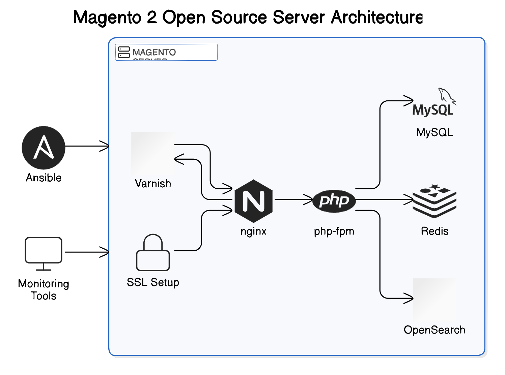

Overview

This repository provides an automated method to deploy a Magento 2 production environment using Ansible and Bash scripts. The setup configures all the necessary services required for a Magento environment, including Nginx, PHP-FPM, MySQL, Redis, Varnish, OpenSearch, and firewall rules with UFW.

This process ensures a consistent, repeatable, and secure setup, with sensitive data (such as the MySQL root password) encrypted and managed using Ansible Vault.

ervices Provisioned
Nginx: Serves as the web server and SSL terminator.
PHP-FPM: Handles PHP processing for Magento.
MySQL: Provides the database for Magento.
Redis: In-memory data structure store used for caching and session storage.
Varnish: HTTP accelerator to cache Magento responses and improve performance.
OpenSearch: Search and analytics engine for Magento.
UFW: Manages firewall rules to secure the server.
Prerequisites
To run this setup, you’ll need:

A server running Ubuntu 20.04 or later.
SSH access to the server with root or sudo privileges.
A valid SSH key to access the server.
Secure Handling of MySQL Password
The MySQL root password is encrypted and stored securely using Ansible Vault. This ensures that sensitive information is not exposed in plaintext within the repository.

Setup and Installation
Step 1: Clone the Repository
Begin by cloning the repository to your local machine:

bash
git clone https://github.com/toby4all/prod-web-services.git
cd magento2-setup if you are already on the ubuntu server because the folder is present there
but if you clonning to a new server or local system cd prod-web-services

Step 2: Configure the Inventory File
Edit the Ansible inventory file located at ansible/inventory/hosts to specify the server details:

ini
[magento2]
your_server_ip ansible_user=ubuntu ansible_port=your_ssh_port ansible_ssh_private_key_file=~/.ssh/id_rsa id you are running this setup from you local system to a server

locally, I used 
[magento2]
localhost ansible_connection=local because i ssh into the unbuntu server already
Note: The MySQL root password is not stored here; it is stored securely in the encrypted vault file.

Step 3: Run the Setup Script
The setup.sh script automates the entire setup process, including the installation of Ansible and necessary collections, and the execution of the playbook that configures all services.

To run the setup script:

bash
Copy code
sudo bash bash-scripts/setup.sh
What the Script Does:
Updates and upgrades the system.
Installs Git, Python3-pip, and other dependencies.
Installs Ansible and required Ansible Galaxy collections (e.g., community.mysql).
Executes the Ansible playbook to configure all the services, including Magento.

Step 4: Handle the MySQL Root Password with Ansible Vault
The MySQL root password is securely stored in the ansible/group_vars/magento2/vault.yml file. This file is encrypted using Ansible Vault, and the password is decrypted during playbook execution.

To run the playbook, you need to provide the vault password:

If you have a vault password file (~/.vault_pass.txt), run:

bash
Copy code
ansible-playbook ansible/playbook.yml -i ansible/inventory --vault-password-file ~/.vault_pass.txt
Alternatively, to be prompted for the vault password, run:

bash
Copy code
ansible-playbook ansible/playbook.yml -i ansible/inventory --ask-vault-pass
Step 5: Verify the Setup
After the script completes, the following services should be installed and configured on the server:

Nginx: Configured to serve Magento with SSL.
PHP-FPM: Processes PHP requests from Magento.
MySQL: Installed and configured with the root password stored securely in the vault.
Redis: Configured for caching.
Varnish: Configured to cache HTTP requests and improve performance.
OpenSearch: Set up to handle Magento’s search and indexing.

UFW: Configured to allow necessary traffic on ports 80 (HTTP), 443 (HTTPS), 8081 (Varnish), 9000 (PHP-FPM), etc.
Step 6: Access Magento in the Browser
Once the services are running, you can navigate to the domain you have configured (e.g., scandiwebtest.magento.com) to access Magento:

bash
Copy code
https://scandiwebtest.magento.com server_name(Dormain used for testing)
You should see the Magento installation page where you can proceed with the setup.

Additional Notes
SSL: A self-signed SSL certificate is generated by default. For production environments, you may replace this with a certificate from a trusted Certificate Authority (CA).
Firewall: UFW is configured to allow traffic on HTTP (80), HTTPS (443), Varnish (8081), and PHP-FPM (9000) ports.
Ansible Vault: The MySQL root password is securely encrypted in the vault file and decrypted during playbook execution.
Testing the Setup
Service Status: Check the status of all services to ensure they are running correctly:

bash
Copy code
sudo systemctl status nginx
sudo systemctl status php7.4-fpm  # or your installed PHP version
sudo systemctl status mysql
sudo systemctl status redis-server
sudo systemctl status varnish
sudo systemctl status opensearch
Firewall Rules: Confirm UFW rules are correctly configured to allow necessary traffic:

bash
Copy code
sudo ufw status
Verify SSL: Check the HTTPS certificate by visiting your domain in a browser and confirming the HTTPS padlock.

Verify Magento: Access the Magento frontend and backend (/admin) and ensure that pages load properly.

Known Issues and Troubleshooting
SSH Connection Issues: Double-check that your inventory file has the correct server IP, SSH user, and private key path.
MySQL Password Issues: If the MySQL root password isn't working, ensure it was properly encrypted in the vault.yml file and the vault password is correct.
Openserch failed to connect or port= 9200 with issues with 
admin password authentication
Firewall Blocks: If you can’t access the server, verify that UFW rules are applied correctly by running sudo ufw status.
Conclusion
This project automates the installation and configuration of a Magento 2 production environment using Ansible and Bash scripts. The setup is secure, scalable, and includes all necessary services to run Magento 2 smoothly. By leveraging Ansible Vault, sensitive information like the MySQL root password is securely managed and encrypted.

## Architecture Diagram 

If you encounter any issues or have further questions, please feel free to reach out for assistance.
